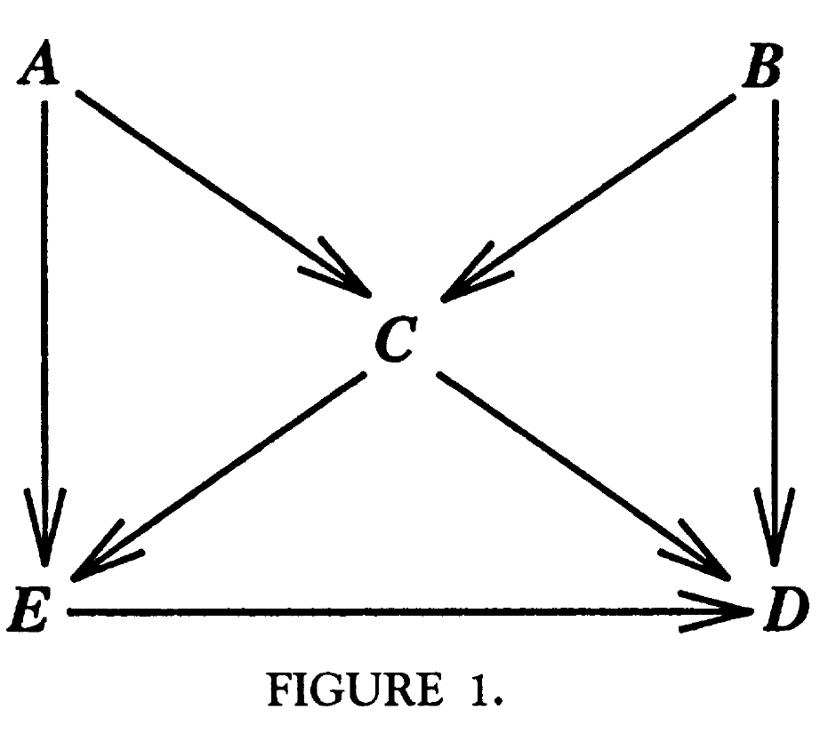
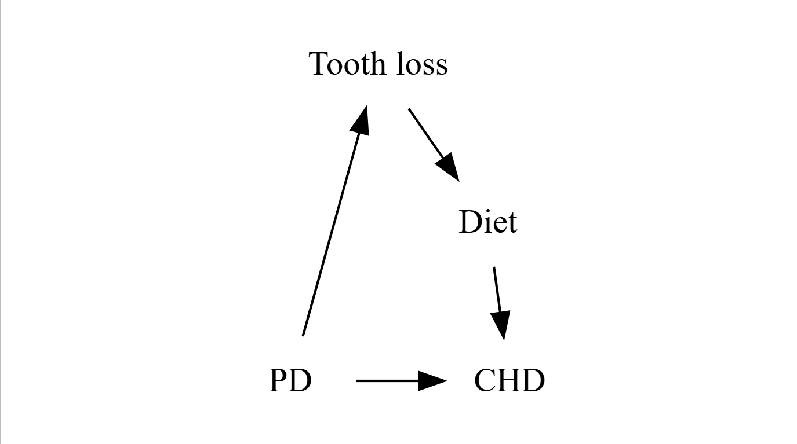

```{r}
#| label: loadPacks

library(ggdag)
library(tinytable)
library(tidyverse)
# library(aod)
# library(summarytools)
# library(gt)
# library(gtsummary)
suppressPackageStartupMessages(library(kableExtra))
suppressMessages(source("gr_terms.R")
)

```

### Syllabus

-   Confounding
-   Directed Acyclic Graphs (DAG Concept)
-   Methods of minimising bias

### Confounder

-   Cause of the outcome
-   Associated with exposure
-   Not an effect of the exposure or outcome

### Causal Diagram

A graphical display of causal relations among variables, in which each variable is assigned a fixed location on the graph (called a node) and in which each direct causal effect of one variable on another is represented by an arrow with its tail at the cause and its head at the effect.

### Directed acyclic graphs

-   A DAG is composed of variables and arrows between variables (nodes and directed edges between nodes).
-   Directed means that there are no bidirectional arrows.
-   Acyclic means that it is not possible to start at any node, follow the directed edges in the arrowhead direction, and end up back at the same node.
-   No arrow between nodes means no causal effect. Single-headed
-   A causal DAG is one in which the arrows can be interpreted as causal relations and in which all common causes of any pair of variables on the graph are also included on the graph.

### Directed Acyclic Graph - an example

::::: {layout-ncol="2"}
::: {#first-column}
{width="40%"}
:::

::: {#second-column}
```{r}
dag_fig1 |>  tinytable::tt() 
```
:::

[@greenland1999]
:::::

### Graph Terminology

```{r}
gr_terms |>  tinytable::tt() 

```

### Examples 1

::::: {layout-ncol="2"}
<div>

[Confounding]{.alert}

```{r}
coord_dag <- list(
  x = c(E = 0, a = -1, O = 2),
  y = c(E = 0, a = 1, O = 0)
)

our_dag <- dagify(O ~ E,
                  O ~ a,
                  E ~ a,
                  coords = coord_dag)

ggdag(our_dag) + theme_void()
```

-   E -\> a -\> O is a backdoor path

</div>

<div>

[Mediation]{.alert}

```{r}
coord_dag <- list(
  x = c(E = 0, b = 1, O = 2),
  y = c(E = 0, b = .5, O = 0)
)

our_dag <- dagify(O ~ b,
                  b ~ E,
                  O ~ E,
                  coords = coord_dag)

ggdag(our_dag) + theme_void()
```

</div>
:::::

### Examples 2

::::: {layout-ncol="2"}
<div>

[Collider]{.alert}

```{r}
coord_dag <- list(
  x = c(L = 0, A = 1, T = 2),
  y = c(L = 0, A = 1, T = 0)
)

act_dag <- dagify(T ~ L,
                  A ~ T,
                  A ~ L,
                  coords = coord_dag)

ggdag(act_dag) + theme_void()
```

-   Collider - node A
-   Blocked path
    -   T -\> A -\> L
    -   or L -\> A -\> T

</div>

<div>

Legend

|     |        |
|-----|--------|
| A   | Actor  |
| L   | Looks  |
| T   | Talent |

</div>
:::::

### Looks and talent

```{r}
set.seed(20260323)
talent <- round(rnorm(10000, mean = 50, sd = 10))
looks <- round(rnorm(10000, mean = 50, sd = 10))
all <- as.data.frame(cbind(talent, looks))
dall <- data.frame(talent, looks)
dall$id <- row(dall)[, 1]

srt <- sample_n(dall, size = 100, weight = dall$talent^10)
srl <- sample_n(dall, size = 100, weight = dall$looks^10)

actors <- rbind(srt, srl)
dall200 <- sample_n(dall, 200)
rpop <- round(cor(dall200$talent, dall200$looks), 3)
ract <- round(cor(actors$talent, actors$looks), 3)
```

::::: {layout-ncol="2"}
<div>

[General population]{.alert}

```{r}
#| fig-height: 4.5
plot(dall200$looks, dall200$talent,
     xlab = "Looks",
     ylab = "",
     cex.lab = 1.8, 
     ylim = c(10, 90), 
     xlim = c(10, 90))
title(sub = paste("r = ", rpop),line = 4.3, cex.sub = 1.8)
title(ylab = "Talent", line = 2, cex.lab = 1.8)
```

</div>

<div>

[Actors]{.alert}

```{r}
#| fig-height: 4.5
plot(actors$looks, actors$talent,
     ylab = "",
     xlab = "Looks",
     cex.lab = 1.8, 
     ylim = c(10, 90), 
     xlim = c(10, 90))
title(sub = paste("r = ", ract),line = 4.3, cex.sub = 1.8)
title(ylab = "Talent", line = 2, cex.lab = 1.8)
```

</div>
:::::

### Periodontal disease and Coronary Heart Disease

-   Hypothesis - Periodontal disease (PD) causes CHD
-   other variables to be considered
    -   tooth loss -\> poor diet -\> IHD
    -   socio-economic status
-   Construct a DAG to show these relationships.
-   Which of the variables should we include in a multivariable model?

### PD -\> CHD



### Minimising Bias

-   Selection bias

-   Information bias

-   Confounding

. . .

-   Descriptive studies

-   Cohort studies

-   Case control studies

-   Clinical trials

### Is this correct about bias?



[The results of a biased study will be further from the truth than those of an unbiased study]{.alert}.

### Prevention and control of bias

1.  Using an appropriate study design, including the selection of participants, for dealing with the study hypothesis
2.  Using valid and reliable data collection methods
3.  Using appropriate analysis methods

### Bias & Observational Studies

-   Exposure identification
    -   Especially in case-control studies
-   Outcome identification
    -   Especially in cohort studies
-   Selection bias
    -   Loss to follow-up in cohort studies
-   Differential
-   Non differential

### Bias and screening programs

-   Selection bias
-   Length bias
-   Lead time bias
-   Overdiagnosis bias

### References
