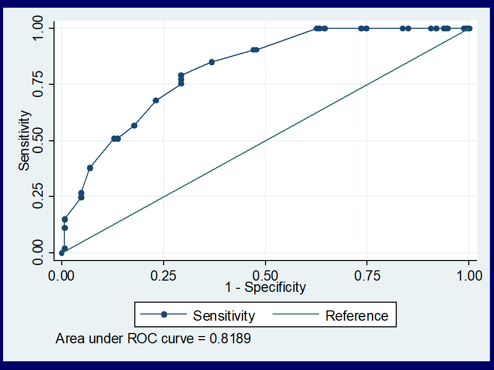

```{r}
#| label: loadPacks

library(ggdag)
library(tinytable)
library(tidyverse)
library(data.table)


```

### Syllabus

-   Reference standard
-   Pre-test probability Post-test probability\
-   Sensitivity, Specificity Positive & Negative Predictive Values (PV)
-   Factors that determine PV\
-   Diagnostic test accuracy, Likelihood Ratios (LR), 95% CI Diagnostic OR,
-   Application & interpretation, Multilevel LRs\
-   ROC curves, construction, interpretation & advantages\
-   Diagnostic research
    -   designs
    -   Sampling methods\
    -   Sample size calculations\
-   Bias in diagnostic accuracy studies\
-   Critical appraisal of diagnostic accuracy study

### Refernce standard - History

-   Early days: The distribution of laboratory results of normal people form a Normal distribution. Therefore $mean \pm 2SD$ will include 95% of the normal/healthy people.

-   Refinement/standardisation of specimen collection, processing and analysis

-   Reference interval became the preferred term

### Reference Interval - Process

```{r}
#| fig-width: 9
library(DiagrammeR)
grViz("digraph flowchart {
      # node definitions with substituted label text
      node [fontname = Helvetica,
      fontsize = 24,
      shape = rectangle]        
      tab1 [label = '@@1']
      tab2 [label = '@@2']
      tab3 [label = '@@3']
      tab4 [label = '@@4']
      tab5 [label = '@@5']
      tab6 [label = '@@6']
      # edge definitions with the node IDs
      tab1 -> tab2 -> tab3 -> tab4 -> tab5-> tab6;
      }

      [1]: 'Reference Population'
      [2]: 'Reference Sample Group'
      [3]: 'Reference Values'
      [4]: 'Reference Distribution'
      [5]: 'Reference Limits'
      [6]: 'Reference Interval'
      ")
```

### Likelihood Ratio (LR)

```{r}
st <- data.table(
test = c("Screen +ve", "Screen -ve"),
Diseased = c("a", "c"),
Healthy = c("b", "d")
)
tt(st) |> style_tt(j = 2:3, align = "c")
```

-   If sensitivity and specificity have already been determined, then
    -   LR+ is sensitivity/(1–specificity)
    -   LR- is (1–sensitivity)/specificity
-   If raw numbers for the 2 X 2 table are available, then
    -   LR+ is $\frac{a/(a+c)}{b/(b+d)}$
    -   LR- is $\frac{c/(a+c)}{d/(b+d)}$
-   The screening test results need not be binary

### Smoking history and obstructive airways disease

```{r}
sd <- data.frame(
  Smoking = c(">40", "21-40", "1-20", "Never", "Total"),
  Yes = c(42, 25, 29, 52, 140),
  No = c(2, 24, 51, 67, 144)
)
tt(sd) |> 
  group_tt(
    j = list(
      "Obstructive airway disease" = 2:3
    )
  ) |> 
  style_tt(j=2:3, align = "r")
```

-   Sensitivity, specificity and predictive values?
-   Calculate and interpret likelihood ratios

### Smoking history and obstructive airways disease

```{r}
sd <- data.frame(
  Smoking = c(">40", "21-40", "1-20", "Never", "Total"),
  Yes = c(42, 25, 29, 52, 140),
  No = c(2, 24, 51, 67, 144)
)

sd$LR <- round((sd$Yes/140)/(sd$No/144),1)

tt(sd) |> 
  group_tt(
    j = list(
      "Obstructive airway disease" = 2:3
    )
  ) |> 
  style_tt(j=2:4, align = "r") |> 
  style_tt(j = 4, i = 5, color = "white")
```

### Likelihood Ratio (LR)

-   Pretest odds X LR = Post test odds

If probability is *p* then $odds = \frac{p}{(1-p)}$

If odds is *o* then $probability = \frac{o}{(1+o)}$

### MDD and PHQ2 in the clinic

```{r}
phq <- data.table(
test = c("PHQ +ve", "PHQ -ve"),
Present = c(60, 15),
Absent = c(3, 72)
)
tt(phq) |> 
   group_tt(
    j = list(
      "Major Depressive Disorder" = 2:3
    )
    )|>  
  style_tt(j = 2:3, align = "r")
```

Calculate the sensitivity, specificity, predictive values and Likelihood ratios of the PHQ



Based on [@hanwella2014]

### MDD and PHQ2 in the community

```{r}
phq0 <- data.table(
test = c("PHQ +ve", "PHQ -ve"),
Present = c(60, 15),
Absent = c(30, 720)
)
tt(phq0) |> 
   group_tt(
    j = list(
      "Major Depressive Disorder" = 2:3
    )
    )|>  
  style_tt(j = 2:3, align = "r")
```

Calculate the sensitivity, specificity, predictive values and Likelihood ratios of the PHQ

### ROC



### ROC data

```{r}
nihl <- readxl::read_excel(here::here("rocd1.xlsx"))
tinytable::tt(nihl) |> tinytable::style_tt(j = 2:4, align = "r")
```

### Diagnostic accuracy studies

-   Design - Cohort or cross-sectional
-   Participants
    -   Consecutive patients with suspected diagnosis
    -   Patients with confirmed diagnosis and a random sample of disease free individuals
-   Sample size - Calculated based on the expected sensitivity and specificity and their acceptable lower limits. The expected prevalence of the condition among the participants should also be taken under consideration if it is a single group study [@bossuyt2023]

### Diagnostic accuracy studies

-   Analysis
    -   Split the data set into training and testing parts
    -   Determine the cutoff value based on ROC curve analysis using one part of the data set
    -   Calculate the sensitivity and specificity using the other part of the data set

### Bias in diagnostic accuracy studies

-   Use of separate samples of affected and disease free individuals
-   Selection criteria
-   Issues related to blinding the test results (test under study and the gold standard test)

Campbell JM, Klugar M, Ding S, Carmody DP, Hakonsen SJ, Jadotte YT, White S, Munn Z. Chapter 9: Diagnostic test accuracy systematic reviews. In: Aromataris E, Munn Z (Editors). JBI Manual for Evidence Synthesis. JBI, 2020

### Risk of bias

1.  Was a consecutive or random sample of patients enrolled?
2.  Was a case control design avoided?
3.  Did the study avoid inappropriate exclusions?\
4.  Were the index test results interpreted without knowledge of the results of the reference standard?
5.  If a threshold was used, was it pre-specified?
6.  Is the reference standard likely to correctly classify the target condition?
7.  Were the reference standard results interpreted without knowledge of the results of the index test?
8.  Was there an appropriate interval between index test and reference standard?
9.  Did all patients receive the same reference standard?
10. Were all patients included in the analysis?

### References
