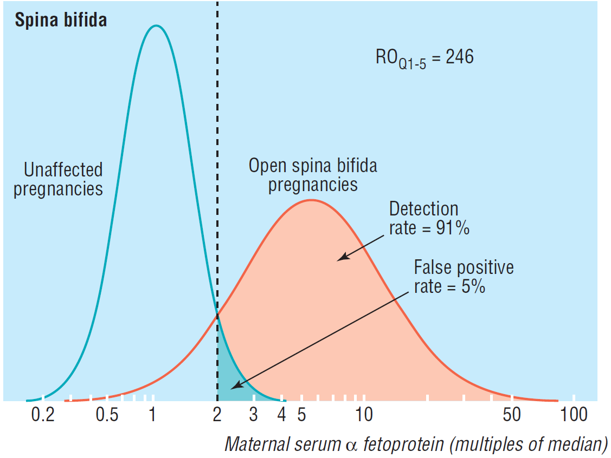
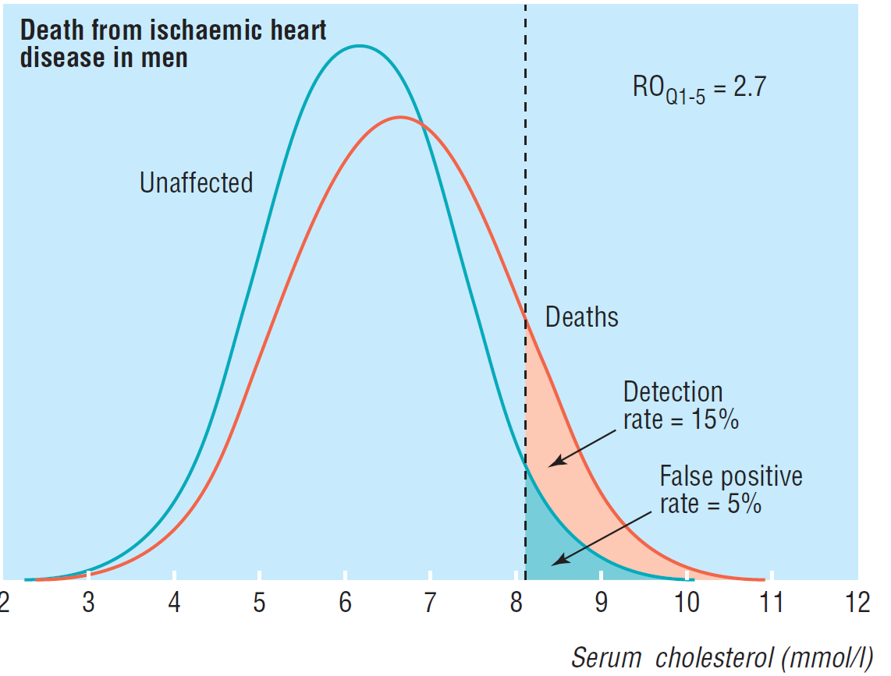

```{r}
#| label: loadPacks
library(data.table)
library(ggdag)
library(tinytable)
library(tidyverse)


```

### Syllabus

-   Disease characteristics
-   Test characteristics\
-   Criteria for screening\
-   Combination of two screening tests
-   Evaluation criteria of screening program\
-   Bias
    -   Lead time bias
    -   Length bias
    -   other bias

### Revision

The usefulness of a questionnaire as a tool to detect noise-induced hearing loss (NIHL) was assessed among a group of 400 traffic policemen working in the Colombo Municipal Council (CMC) area.

```{r}
nihl <- readxl::read_excel(here::here("nihl.xlsx"))
tinytable::tt(nihl) |> tinytable::style_tt(j = 2:4, align = "r")
```

-   Comment on the sensitivity, specificity and predictive values.
-   Explain whether this questionnaire can be used as a screening tool to detect NIHL.

### Assessing a screening test

-   Sensitivity – ability to identify cases correctly
-   Specificity – ability to identify disease-free persons correctly
-   Positive predictive value (**Predictive value of a positive test** or PV +ve) – Probability of a person with a positive test having the disease
-   Negative predictive value (**Predictive value of a negative test** or PV–ve) - Probability of a person with a negative test being disease-free

### Screening

-   The presumptive identification of unrecognised disease or defects by the application of tests, examinations or other procedures which can be applied rapidly.
-   Screening tests sort out apparently well persons who probably have a disease from those who probably do not.

### Why screen?

-   To reduce morbidity or mortality from the disease among the people screened - earlier detection & treatment...

-   Control of communicable diseases

-   Determine natural history

-   Educational opportunity

### Types of screening

-   Mass screening - whole population
-   Multiple / multiphasic screening
    -   Variety of tests on same occasion
-   Targeted screening
    -   High risk group (occupation)
-   How about Case finding?

### Prerequisites for successful screening

1.  The condition sought should be an important health problem.
2.  There should be an accepted treatment for patients with the disease.
3.  Facilities for treatment and diagnosis should be available.
4.  There should be a recognizable latent or early symptomatic stage.
5.  There should be a suitable test or examination.

### Prerequisites for successful screening (Contd.)

6.  The test should be acceptable to the population.
7.  The natural history of the condition should be adequately understood.
8.  There should be an agreed policy on whom to treat as patients.
9.  The cost should be economically balanced in relation to possible expenditure on medical care as a whole.
10. Case-finding should be a continuing process and not a once and for all project.

### Suitable test for spina bifida



### Suitable test for IHD?[@wald1999]



### Possible benefits of screening

-   Improved prognosis
-   Reduced morbidity
-   Improved quality of life
-   Reduced resources needed for treatment
-   Reassurance from a correct negative test

### Screening is associated with

-   Increased survival time
-   Reduced case fatality

[Are these real? Or due to –]{.alert}

-   Lead time bias and / or
-   Length bias

### Possible adverse effects associated with screening

-   Prolonged period of morbidity
-   Diagnosis of pseudo-disease and over-treatment
-   False reassurance from a false negative test
-   Anxiety and morbidity associated with a false positive test
-   Morbidity associated with the test itself
-   Diverting resources from other services

Preventing Harm or Harming the Healthy? [@taal2012]\
Preventing overdiagnosis: how to stop harming the healthy [@moynihan2012]

### Prior to adopting a screening program -

-   Has the effectiveness been demonstrated?
-   Are there efficacious treatments for the disorder?
-   Does the current burden warrant a program?
-   Is there a good test?

### References
