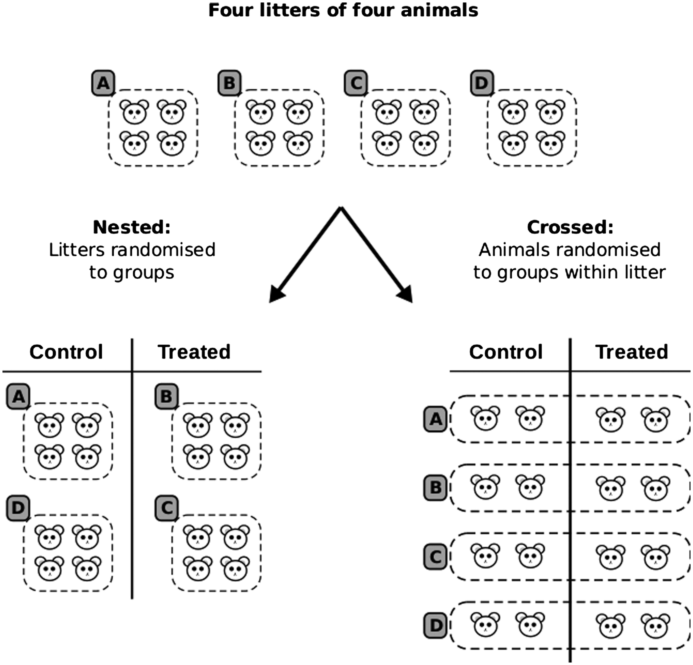

```{r}
#| label: packages 
#| echo: false
#| message: false
#| warning: false

suppressMessages(library(tinytable))
```


### Outline - Prospectus {.smaller}

-   Simple random sampling: Estimation of population mean, proportion & total
-   Probabilities proportional to size (PPS)
-   Stratified sampling: Estimation of population mean, proportion & optimal rule for choosing strata
-   Systematic sampling: Estimation of population mean, proportion & total
-   Cluster sampling: Estimation of population mean, proportion & total
    a.  Equal & unequal cluster size
    b.  PPS
-   Two stage cluster sampling
-   Cluster sampling combined with stratification

### My Outline

-   Definitions\
-   Description of methods\
-   Specific issues

### Sampling

-   A **sample** is a selected subset of the population that is used to gather information about the population.

-   **Sampling** is the process of selecting a number of units from the population.

-   The term **population** (or universe) refers to the whole collection of **units** or **elements** (Persons, Records, or Events).

### Populations

1.  Reference population\

2.  Target population\

3.  Parent population\

    ------------------------------------------------------------------------

4.  Sampled population\

5.  Study population

### Benefits of Sampling

-   Reduction in time\
-   Reduction in labour\
-   Reduction in cost

. . .

-   Improved quality of data

. . .

-   Provided the sample is representative of the population


### Probability Sampling - Terminology 1

```{r}

tab1 <- data.frame(
  Ideal = c(
    "Epsem: equal probability for all elements",
    "a) Equal probabilities at all stages",
    "b) Equal overall probability achieved by compensating unequal probabilities at several stages"),
  Alternative = c(
    "Unequal probabilities for different elements (use weights during analysis)",
    "a) Caused by irregularities in frames and/ or procedures",
    "b) Disproportionate allocation designed for optimum allocation"
  )
)

tab1nh <- tab1
colnames(tab1nh) <- NULL
tt(tab1nh) |> 
  style_tt(fontsize = 1.2) |> 
  style_tt(i = 2, j = 2,
           line = "tb",
           line_width = 0.05,
           line_color = "grey")
```

### Exercise 1

```{r}
x <- seq(1000, 3000, 100)
set.seed(123)
x8 <- sort(sample(x, 8, replace = TRUE))
x8[7] <- 2000
x8 <- sort(x8)

d1 <- data.frame(GN = LETTERS[1:8],
                  pop= x8)
tt(d1)
```
- Total population - `r noquote(sprintf("%.0f", sum(d1$pop)))`  
- Sample size of 400 to be selected in two stages - select four GN divisions and then select the individuals from those four GN divisions.
- How would you select an epsem sample?

### Exercise 1 

```{r}
d1$C_pop <- cumsum(d1$pop)
tt(d1) |> style_tt(j = 2:3, align = 'r')
```


### Probability Sampling - Terminology 2

```{r}
tab1 <- data.frame(
  Ideal = c(
    "Element Sampling: single stage & sampling unit contains only one element",
    "",
    "",
    "",
    ""
    ),
  Alternative = c("Cluster Sampling: sampling units are clusters of elements",
                  "a) One-stage cluster sampling",
                  "b) Subsampling or multistage sampling",
                  "c) Equal clusters",
                  "d) Unequal cluster"
  )
)

tab1nh <- tab1
colnames(tab1nh) <- NULL
tt(tab1nh) |> 
  style_tt(fontsize = 1.2) |> 
  style_tt(i = 2:4, j = 2,
           line = "tb",
           line_width = 0.05,
           line_color = "grey")
```


### Probability Sampling - Terminology 3

```{r}

tab1 <- data.frame(
  Ideal = c(
    "Unstratified Selection: sampling units selected from entire population"),
  Alternative = c(
    "Stratified Sampling: separated selections from partitions or strata of population"
  )
)

tab1nh <- tab1
colnames(tab1nh) <- NULL
tt(tab1nh) |> 
  style_tt(fontsize = 1.2) 
```

### Probability Sampling - Terminology 4


```{r}

tab1 <- data.frame(
  Ideal = c(
    "Random selection of individual sampling units from entire stratum or population"),
  Alternative = c(
    "Systematic Selection of sampling units with selection interval applied to list"
  )
)

tab1nh <- tab1
colnames(tab1nh) <- NULL
tt(tab1nh) |> 
  style_tt(fontsize = 1.2) 
```


### Probability Sampling - Terminology 5

```{r}

tab1 <- data.frame(
  Ideal = c(
    "One-Phase Sampling: final sample selected directly from entire population"),
  Alternative = c(
    "Two-phase (or Double) Sampling: final sample selected from first phase sample which provides information for stratification or estimation"
  )
)

tab1nh <- tab1
colnames(tab1nh) <- NULL
tt(tab1nh) |> 
  style_tt(fontsize = 1.2) 
```


### Simple Random Sampling

-   Requires a complete sampling frame (a listing of all units/ elements) and random numbers.
    -   Never use a physical lottery to select elements

 

-   Each element has equal probability of being selected.

### Perfect Sampling Frame

-   Every element appears separately
-   Once\
-   Only once\
-   Nothing else

### Perfect listing

-   Every element must appear in a listing and only in one listing\
    \

-   Every listing must contain an element and only one element

### Questions 1

1.  Discuss the advantages and disadvantages of using the electoral register as the sampling frame to sample adults living in a district.

2.  Discuss the advantages and disadvantages of using the electoral register as the sampling frame to sample women aged 35 to 40 years living in a district.

### Systematic Sampling

-   Random numbers are not required. Every nth person from the sampling frame is selected.\
-   Useful in sampling
    -   Patients attending a clinic\
    -   

 

-   **Caution:** When the frame is organized according to some pattern and if the sampling interval overlaps this pattern ...

### Cluster sampling

-   The units are not selected in to the sample individually but as groups or clusters.\
-   This may be done when a complete sampling frame is not available but it is known that the units belong to some larger groupings.

### Cluster sampling

-   Cluster size
    -   Consider logistics
    -   Check design effect

$$ Deff = [1 + (n - 1)\rho] $$ Deff - Design effect\
n - cluster size\
$\rho$ - Intraclass correlation coefficient\
\* Assuming equal size clusters

### Cluster sampling

-   Reasonably efficient if
    -   there is low homogeneity within clusters
    -   cluster size is small\
-   Determining cluster size and the number of clusters
-   Consider logistics

### Stratified sampling

-   When it is known that the characteristic under investigation is related to another variable, the population under study could be stratified according to the second variable.

 

-   Proportionate allocation or not?

### Malnutrition by sector

In 2022, the prevalence of underweight among chidren under 5 was reported as - 

- Estate sector 25%
- Rural sector 15%
- Urban sector 10%

Calculate the national prevalence of underweight.

. . .   

The sectorwise distribution of the population -  
Estate 5%, Rural 75% and Urban 20%


### Clinical trials{.smaller}

-   Selection of participants is not random
-   Random allocation of individuals to treatment groups
-   Random allocation within strata (each trial site can be considered a stratum)
-   Cluster randomization (in field trials schools, PHM areas or clinics can be considered as clusters )

. . .

-   Block randomization (instead of random allocation of the whole list small blocks are created and random allocation is within these blocks) - ensures almost equal group sizes even if the trial is terminated early.

### Terminology

{fig-align="center"}

### Multistage sampling

-   Selecting the sample in more than one stage. Multistage sampling enables the investigator to concentrate/restrict the fieldwork to selected areas.

### Other Sampling methods

-   Area sampling

-   Quota sampling

-   Convenience sampling

-   Snowball sampling

-   Respondent driven sampling (RDS)

-   All these are technical terms

-   In many instances combinations or modifications are necessary

### Questions 2

Discuss the issues that should be considered in designing the sample for - 

1. a national survey on snakebite to obtain data at provincial level. The total affordable sample size is 45,000 households.

2. a survey to determine the prevalence of STH infections among schoolchildren in each province of Sri Lanka, and in high risk populations in the plantation sector and low income settlements in urban areas. Total affordable sample size is about 5000 children.


### Remember


::: {.block fill="luma(221)" inset="8pt" radius="4pt"}

"As you design, so should you analyse." Reviewer #2
:::

### Summary

-   The sample should be representative of the population
-   The sampling scheme should be taken into consideration during data analysis

[Statistics Canada](https://www150.statcan.gc.ca/n1/edu/power-pouvoir/ch13/prob/5214899-eng.htm)

### Sample size for validation of a screening test

An existing screening instrument to detect condition X is to be translated and validated for use in Sri Lanka. The reported sensitivity and specificity of this instrument are 90% and 85%, respectively. The research team has access to patients undergoing the diagnostic test. Usually, about 50% of those undergoing the diagnostic test are found to have condition X.  
What should be the sample size for this validation study?
