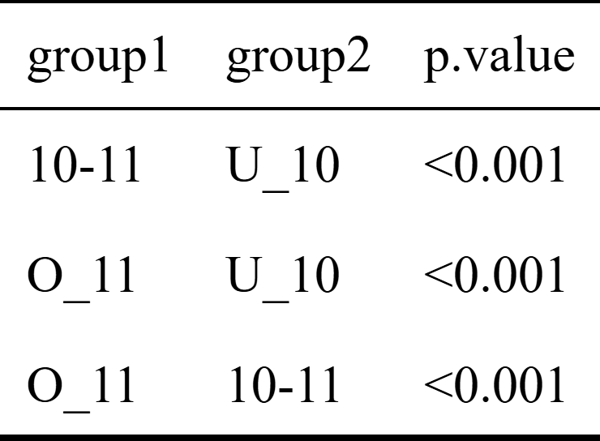
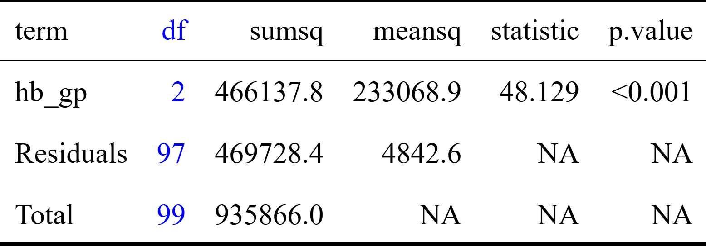

```{r}
#| label: packages 
#| echo: false
#| message: false
#| warning: false
suppressMessages(library(tidyverse))
suppressMessages(library(gtsummary))
suppressMessages(library(broom))
suppressMessages(library(tinytable))
suppressMessages(library(tinyplot))
suppressMessages(library(summarytools))
```

```{r}
#| label: get_data
#| echo: false
load(here::here("data", "tea.rda"))
tea$tealeave_m <- round(tea$tealeave*tea$dayswork)

set.seed(123456)
t100 <- tea %>%
  filter(tealeave_m>100) %>%
  filter(tealeave_m<500) %>%
  group_by(division) %>%
  slice_sample(n = 25) %>%
  filter(division != "N") 
t100 <- t100 %>% 
  mutate(hb_gp=cut(newhb, breaks=c(0, 9.99, 11, 20), labels=c("U_10","10-11","O_11")))
t100 <- t100 %>% 
  mutate(age_gp=cut(age, breaks=c(0, 34, 44,  69), labels=c("U_35","35-44","44-59")))


```

### Syllabus

One way ANOVA:

a.  applications
b.  calculations
c.  interpretation of ANOVA table
d.  application & interpretation of post-hoc tests
e.  Bonferroni adjustment

### Analysis of Variance - ANOVA

-   A technique for comparison of means of multiple groups
    -   A special case of this (means of two groups) is the t test
    -   Why call it analysis of variance if it is used for the comparison of means
-   Why not use multiple t tests?

### Probability App by Matt Bognar

:::: {layout-ncol=2}
::: {#first-column}

[iOS]{.alert}

```{r}
qr2 <- qrcode::qr_code("https://apps.apple.com/us/app/probability-distributions/id889106396")
plot(qr2)
```


:::

::: {#second-column}

[Android]{.alert}

```{r}
qr1 <- qrcode::qr_code("https://play.google.com/store/apps/details?id=com.mbognar.probdist&pcampaignid=web_share")
plot(qr1)
```

:::
::::

### Data (Number of records = `r nrow(t100)`)

```{r}
#| Label: sample_data
t100 %>% dplyr::select(tealeave_m, division, age_gp, hb_gp) %>% head(7)  |> 
  tt(width = .8, height = 2) |> 
  style_tt(fontsize = 1.5) 
```

### Data Summary 1 

```{r}
#| label: d_summary1
#| message: false
st1 <- t100 %>% dplyr::select(tealeave_m, division) %>%
  tbl_summary(statistic = all_continuous() ~ "{mean} ({sd})")  
    
```

### Data Summary 2

:::: {layout-ncol=2}
::: {#first-column}
```{r}
#| label: d_summary21
#| message: false
freq(t100$division, cumul = FALSE, report.nas = FALSE)

```

:::

::: {#second-column}
```{r}
#| label: d_summary22
#| message: false

freq(t100$age_gp, cumul = FALSE, report.nas = FALSE)
```

:::
:::

### Productivity by division

```{r}
#| label: plot_div
#| message: false
#| fig-width: 12
#| fig-height: 6
tinyplot(
  tealeave_m ~ division,
  data = t100,
  type = "box",
  xaxl = "," ,
  xlab = "Division",
  grid = TRUE,                         
  ylab = "Tealeaves plucked per month (in kg)",
  draw = abline(h = mean(t100$tealeave_m), lty = 2 , lwd = 2, col = "blue"))

```

### Productivity by division another plot

```{r}
#| label: plot_div_den
#| message: false
#| fig-width: 12
#| fig-height: 6

tinyplot(
  ~ tealeave_m | division,
  data = t100,
  type = "density",
#  fill = "by",                        
  grid = TRUE,                         
  legend = list("topright", bty = "o"),
  xlab = "Tealeaves plucked per month (in kg)"
)
plt_add(
  ~ tealeave_m,
  data = t100,
  type = "density",
  grid = TRUE,
  fill = "lightgrey",
  col = "yellow",
  lwd = 2)

```


### Productivity by Division

```{r}


t100 %>% group_by(division) %>% 
  summarise(Mean = mean(tealeave_m), SD = sd(tealeave_m), N = n()) %>% 
    tt(width = .8, height = 2) |> 
  format_tt(j = 2, digits = 4) |> 
  format_tt(j = 3, digits = 3) |> 
  style_tt(fontsize = 1.5) 

```


### Pairwise t tests

:::: {layout-ncol=2}
::: {#first-column}

```{r}


t100 %>% group_by(division) %>% 
  summarise(Mean = mean(tealeave_m), SD = sd(tealeave_m), N = n()) %>% 
    tt(height = 2) |> 
  format_tt(j = 2, digits = 4) |> 
  format_tt(j = 3, digits = 3) |> 
  style_tt(fontsize = 1.5) 

```

:::  
::: {#second-column}

```{r}
ptt <- pairwise.t.test(t100$tealeave_m, t100$division, p.adjust = "none")
tidy(ptt) |> 
  tt() |> 
  format_tt(j = 3, fn = function(x) sprintf("%.3f", x))
```

:::
:::

### Adjusting p value for multiple comparison - Bonferroni{.smaller}

Probability of Type 1 error for a single test is 0.05\

What is the probability of Type 1 error for two tests?  

 . . .   
 
Probability of Type 1 error for two tests is $1 - 0.95^2 = 0.1$

For *n* tests

$$ 1- 0.95^2 \approx 0.05 \times 2$$ $$ 1- 0.95^n \approx 0.05 \times n$$

A p value from multiple (n) comparisons should be $\frac{0.05}{n}$ to be significant at 0.05

  Correcting a p value for multiple (n) comparisons - p value $\times n$

### Pairwise t test (Bonferroni)

:::: {layout-ncol=2}
::: {#first-column}

[Unadjusted p values]{.alert}
```{r}
ptt <- pairwise.t.test(t100$tealeave_m, t100$division, p.adjust = "none")
tptt <- tidy(ptt) 
tptt$p.value[tptt$p.value == 1] <- 0.999
tt(tptt) |> 
  format_tt(j = 3, fn = function(x) sprintf("%.3f", x))
  
```
:::

::: {#second-column}

[Adjusted p values (Bonferroni)]{.alert}
```{r}
ptt <- pairwise.t.test(t100$tealeave_m, t100$division, p.adjust = "bonferroni")
tptt <- tidy(ptt) 
tptt$p.value[tptt$p.value == 1] <- 0.999
tt(tptt) |> 
  format_tt(j = 3, fn = function(x) sprintf("%.3f", x))
```
:::
:::

### Adjusting p value for multiple comparison - Holm

-   Bonferroni method

    -   Correcting for multiple (n) comparisons - p value $\times n$\

-   Holm method

    -   Arrange the (n) p values in ascending order\
    -   Smallest p value \< $\frac{0.05}{n}$ *Significant*\
    -   Next p value \< $\frac{0.05}{n-1}$ *Significant*\
    -   Continue till a not significant results

### Pairwise t test (Holm's adjustment)

:::: {layout-ncol=2}
::: {#first-column}

[Unadjusted p values]{.alert}
```{r}
ptt <- pairwise.t.test(t100$tealeave_m, t100$division, p.adjust = "none")
tptt <- tidy(ptt) 
tptt$p.value[tptt$p.value == 1] <- 0.999
tt(tptt) |> 
  format_tt(j = 3, fn = function(x) sprintf("%.3f", x))
```
:::

::: {#second-column}

[Adjusted p values]{.alert}
```{r}
ptt <- pairwise.t.test(t100$tealeave_m, t100$division, p.adjust = "holm")
tptt <- tidy(ptt) 
tptt$p.value[tptt$p.value == 1] <- 0.999
tt(tptt) |> 
  format_tt(j = 3, fn = function(x) sprintf("%.3f", x)) |> 
  style_tt(j = 3, i = c(2, 3, 5, 6), color = "grey")
```
:::
:::


### Pairwise t test - Bonferroni Vs Holm's

:::: {layout-ncol=3}
::: {#first-column}

[Unadjusted p values]{.alert}
```{r}
ptt <- pairwise.t.test(t100$tealeave_m, t100$division, p.adjust = "none")
tptt <- tidy(ptt) 
tptt$p.value[tptt$p.value == 1] <- 0.999
tt(tptt) |> 
  format_tt(j = 3, fn = function(x) sprintf("%.3f", x))
```
:::

::: {#second-column}

[Bonferroni]{.alert}
```{r}
ptt <- pairwise.t.test(t100$tealeave_m, t100$division, p.adjust = "bonferroni")
tptt <- tidy(ptt) 
tptt$p.value[tptt$p.value == 1] <- 0.999
tt(tptt) |> 
  format_tt(j = 3, fn = function(x) sprintf("%.3f", x))
```
:::

::: {#third-column}

[Holm]{.alert}
```{r}
ptt <- pairwise.t.test(t100$tealeave_m, t100$division, p.adjust = "holm")
tptt <- tidy(ptt) 
tptt$p.value[tptt$p.value == 1] <- 0.999
tt(tptt) |> 
  format_tt(j = 3, fn = function(x) sprintf("%.3f", x)) |> 
  style_tt(j = 3, i = c(2, 3, 5, 6), color = "grey")
```
:::
:::


### Sum of squares

Sum of squared deviations or sum of squares about the mean $\Sigma(x_i - \bar x)$\
  Calculation of the variance and standard deviation is based on this.

### ANOVA Calculation

Deviation from grand mean = Deviation form group mean + deviation of the group mean from the grand mean

$$y_{ij} - \overline{y} = (y_{ij} - \overline{y_{i}}) + (\overline{y_{i}} - \overline{y})$$
$$\sum_{i,j}(y_{ij} - \overline{y})^2 = \sum_{i,j}(y_{ij} - \overline{y_{i}})^2 + \sum_{i,j}(\overline{y_{i}} - \overline{y})^2$$

-   Sum of squares (SSq)
    -   Total SSq = Between group SSq + Within group (Residual) SSq

-   The F statistic is based on
    -   Comparison of between group variation with within group variation


$$F\ statistic =  \frac{Between\ group\ MSq}{Residual\ MSq}$$


### Calculate ANOVA

:::: {layout-ncol=2}
::: {#first-column}

```{r}
t100 %>% group_by(division) %>% 
  summarise(Mean = mean(tealeave_m), SD = sd(tealeave_m), N = n()) |> 
  tt() |> 
  format_tt(j = 2:3, fn = function(x) sprintf("%.1f", x))
```
:::

::: {#second-column}
```{r}
t100 %>% ungroup() %>% 
  summarise(Mean = mean(tealeave_m), SD = sd(tealeave_m), N = n()) |> 
  tt() |> 
  format_tt(j = 1:2, fn = function(x) sprintf("%.1f", x))
```
:::
:::

### ANOVA

```{r}
a1 <- aov(tealeave_m ~ division, t100)
tidy(anova(a1)) %>% 
  add_row(term = "Total", df = sum(.$df), sumsq = sum(round(.$sumsq)) ) %>% 
    tt()|> 
  style_tt(j = 2:6, align = 'r') |> 
  format_tt(j = c(5, 6), fn = function(x) sprintf("%.3f", x))|> 
  format_tt(j = c(3, 4), fn = function(x) sprintf("%.1f", x)) |> 
  format_tt(replace = list( "<0.001" = "0.000"))
```

### Productivity by Age

```{r}
#| label: plot_age
#| message: false
#| fig-width: 12
#| fig-height: 6
tinyplot(
  tealeave_m ~ age_gp,
  data = t100,
  type = "box",
  xaxl = "," ,
  xlab = "Age", 
  cex.names = 2, cex.lab = 2.2,
  grid = TRUE,                         
  ylab = "Tealeaves plucked per month (in kg)",
  draw = abline(h = mean(t100$tealeave_m), lty = 2 , lwd = 2, col = "blue"))

```

### Pairwise t test (Age group)

:::: {layout-ncol=2}
::: {#first-column}

```{r}

t100 %>% group_by(age_gp) %>% 
  summarise(Mean = mean(tealeave_m), SD = sd(tealeave_m), N = n()) |> 
  tt() |> 
  format_tt(j = 3, fn = function(x) sprintf("%.1f", x))
```

:::

::: {#second-column}

```{r}
ptt <- pairwise.t.test(t100$tealeave_m, t100$age_gp, p.adjust = "none")
tidy(ptt) |> 
  tt() |> 
  format_tt(j = 3, fn = function(x) sprintf("%.3f", x))
```

:::
:::

### ANOVA -Productivity by Age

```{r}
a2 <- aov(tealeave_m ~ age_gp, t100)
tidy(anova(a2)) %>% 
  add_row(term = "Total", df = sum(.$df), sumsq = sum(round(.$sumsq)) ) %>% 
  tt()|> 
  style_tt(j = 2:6, align = 'r') |> 
  format_tt(j = c(5, 6), fn = function(x) sprintf("%.3f", x))|> 
  format_tt(j = c(3, 4), fn = function(x) sprintf("%.1f", x))
```

### Productivity by Hb

```{r}
#| label: plot_hb
#| message: false
#| fig-width: 12
#| fig-height: 6
tinyplot(
  tealeave_m ~ hb_gp,
  data = t100,
  type = "box",
  xaxl = "," ,
  xlab = "Hb level",
  grid = TRUE,                         
  ylab = "Tealeaves plucked per month (in kg)",
  draw = abline(h = mean(t100$tealeave_m), lty = 2 , lwd = 2, col = "blue"))

```
### Productivity by Hb another plot

```{r}
#| label: plot_hb_den
#| message: false
#| fig-width: 12
#| fig-height: 6

tinyplot(
  ~ tealeave_m | hb_gp,
  data = t100,
  type = "density",
#  fill = "by",                        
  grid = TRUE,                         
  legend = list("topright", bty = "o"),
  xlab = "Tealeaves plucked per month (in kg)"
)
plt_add(
  ~ tealeave_m,
  data = t100,
  type = "density",
  grid = TRUE,
  fill = "lightgrey",
  col = "yellow",
  lwd = 2)

```


### Pairwise t test (Hb group)

:::: {layout-ncol=2}
::: {#first-column}

```{r}

t100 %>% group_by(hb_gp) %>% 
  summarise(Mean = mean(tealeave_m), SD = sd(tealeave_m), N = n()) |>   tt() |> 
  format_tt(j = 2:3, fn = function(x) sprintf("%.1f", x))
```

:::

::: {#second-column}

```{r}

ptt <- pairwise.t.test(t100$tealeave_m, t100$hb_gp, p.adjust = "none")
tidy(ptt) |> 
  tt() |> 
  format_tt(j = 3, fn = function(x) sprintf("%.3f", x))|> 
  format_tt(replace = list( "<0.001" = "0.000")) |> 
  tt_save("hbgtt.png", overwrite = TRUE)
```

{fig-align="center"}

:::
::: 

### ANOVA -Productivity by Hb

```{r}
a3 <- aov(tealeave_m ~ hb_gp, t100)
tidy(anova(a3)) %>% 
  add_row(term = "Total", df = sum(.$df), sumsq = sum(round(.$sumsq)) ) %>% 
  tt()|> 
  style_tt(j = 2:6, align = 'r') |> 
  format_tt(j = c(5, 6), fn = function(x) sprintf("%.3f", x))|> 
  format_tt(j = c(3, 4), fn = function(x) sprintf("%.1f", x)) |> 
  format_tt(replace = list( "<0.001" = "0.000")) |> 
  style_tt(j = 2, color = "blue") |> 
  tt_save("a3.png", overwrite = TRUE)
```
{fig-align="center"}

### SSq - Total = Between group + Within group (Residual)?

```{r}
myd <- data.frame(gp = rep(c("a", "b", "c"), each = 3),
                  score = 1:9,
                  tm = 5,
                  gm = rep(c(2, 5, 8), each = 3))

myd$s_tm <- myd$score - myd$tm
myd$s_gm <- myd$score - myd$gm
myd$tm_gm <- myd$tm - myd$gm

myd$ss_tm <- myd$s_tm^2
myd$ss_gm <- myd$s_gm^2
myd$stm_gm <- myd$tm_gm^2

```

#### Fictious data

```{r}
tt(myd[,1:2]) |> 
  style_tt(i = 4:6, background = "lightblue") |> 
  style_tt(align = 'r')
```

### Fictious data 2

```{r}
tt(myd[,1:7])|> 
  style_tt(i = 4:6, background = "lightblue") |> 
  style_tt(align = 'r')
```

### Fictious data 3

```{r}
tt(myd[,1:10]) |> 
  style_tt(i = 4:6, background = "lightblue") |> 
  style_tt(align = 'r')
```

. . .  

`r colSums(myd[,8:10])`


### ANOVA output for the fictious data

```{r}
a4 <- aov(score ~ gp, myd)
tidy(anova(a4)) %>% 
  add_row(term = "Total", df = sum(.$df), sumsq = sum(round(.$sumsq)) ) %>% 
  tt()|> 
  style_tt(j = 2:6, align = 'r')
#  knitr::kable(digits = c(0, 0, 1, 1, 1, 3))
```
  
