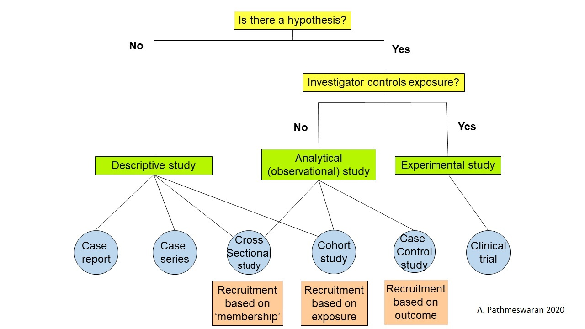

```{r}
#| label: loadPacks

# library(tidyverse)
# library(aod)
# library(summarytools)
# library(gt)
# library(gtsummary)

```

### Syllabus

-   Descriptive Studies
-   Analytical Studies

### Study Designs



[Hypothesis]

## Descriptive studies

### Descriptive study

Answers to the following W questions

-   who
    -   age, sex, occupation, habits, etc.
-   when
    -   time of the day, day of the week, seasonality, trend over time
-   where
    -   geography, urban/ rural
-   what
    -   case definition
-   why
    -   develop a hypothesis

### Case reports & case series

-   Provide early clues
    -   Broca's area
    -   Early series of AIDS cases

Cluster of cases of the acquired immune deficiency syndrome: Patients linked by sexual contact  

Am J Med. 1984 Mar;76(3):487-92. Auerbach DM, Darrow WW, Jaffe HW, Curran JW

### Descriptive cross-sectional study/ Prevalence study

-   To determine the burden of disease or risk factor
-   Steps
    -   Define outcome
    -   Define the target population.
    -   Calculate sample size (or recruit the whole population)
    -   Select sample
    -   Collect data
    -   Calculate prevalence (as %, per 1000 or 100 000)

### Cross-sectional studies - possible biases

-   **Selection** of participants

-   Collecting **Information**

-   Confounding

### Surveillance

::: {.callout-note icon="false"}
## Definition

Surveillance is a continuous, systematic process of collecting, analysing, interpreting, and disseminating descriptive information to monitor health problems.
:::

-   Define -

    -   case definition
    -   target population

-   Active vs Passive

    -   Can surveillance be passive?

### Surveillance - examples

-   Notifiable diseases

-   Workplace accidents

-   Sentinel surveillance

-   Disease registries

    -   TB, leprosy

    -   Cancer

    -   ones maintained by interested clinicians

### Covid data

#### Any possibility of bias?

-   Number of clinical cases

-   Laboratory results

    -   Virology

    -   Serology

-   Vaccination coverage

## Analytical study

### Hypothesis

-   The presence of a hypothesis distinguishes an analytical from a descriptive cross-sectional study. [Study Designs]

. . .

-   Are studies looking for correlates analytical studies?

### Cross-sectional analytical studies - Steps

-   Define outcome

-   Define exposure

-   Define the target population.

-   Calculate sample size (or recruit the whole population)

-   Select sample

-   Collect data

    -   Calculate measures of effect

### Cross-sectional analytical studies - Measures of effect

-   Prevalence risk ratio

    -   Adjustment using multivariable analysis is difficult

-   Odds ratio

    -   Adjusted OR using multiple logistic regression

### Cross-sectional analytical studies - Limitations

-   Exposure outcome relationship

    -   Current exposure status vs past exposure status

    -   Induction time

    -   Time of occurrence and timing of the study

    -   Exposure status and survival

### Are cohort studies always analytical?

-   What if we follow up only one group?
